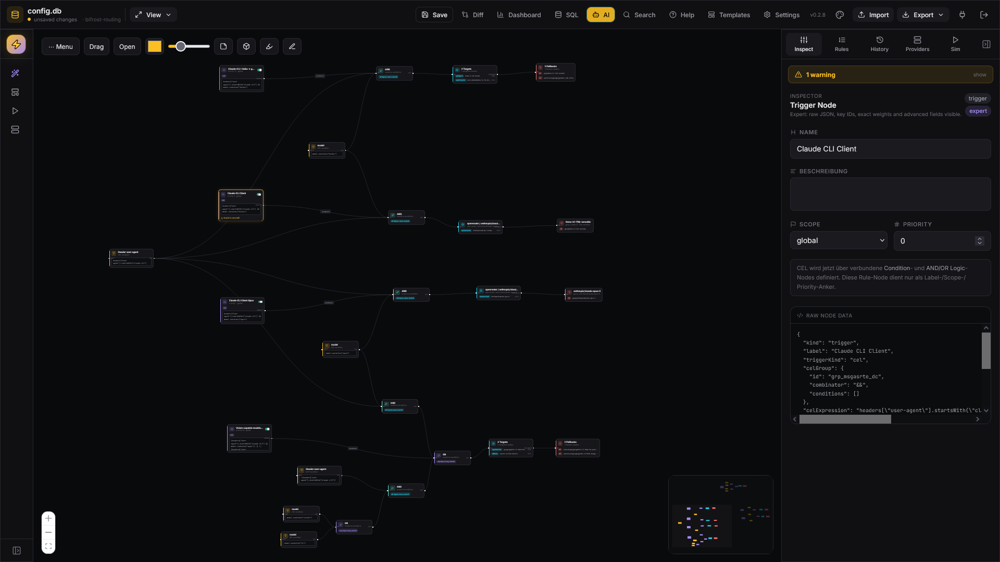
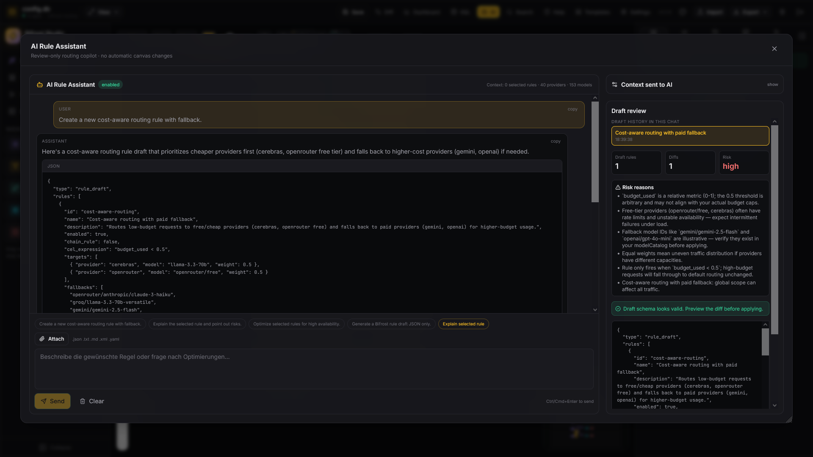
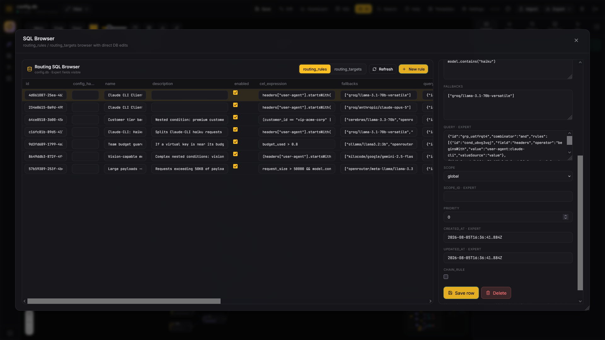

# ⚡ Bifrost Router Studio

A browser-based SQLite editor and visual routing-rule planner for **Bifrost AI Gateway**.
Open a Bifrost `.sqlite`/`.db` configuration store, inspect and edit routing rules visually, then export the modified database or interoperable config files.

The default app is client-side: SQLite runs in the browser through `sql.js`/WASM, and in that mode no data leaves your machine. Two opt-in paths leave the browser: an optional local bridge for server-side file paths, and **live gateway mode**, where you connect straight to a running Bifrost instance over its management API and push rule changes to it.

## What you can do

- Open a real Bifrost SQLite config store directly in the browser.
- Connect to a running gateway and sync routing rules to it over the management API.
- Build routing rules visually with Rule, Condition, AND/OR Logic, Target and Fallback nodes.
- Edit rules through the canvas, the Rules panel, or the SQL Browser.
- Keep Bifrost-compatible `cel_expression`, `targets`, `fallbacks` and dashboard `query` state in sync.
- Compare canvas changes against the live SQLite DB before saving.
- Run request simulations and inspect the matched routing path.
- Use templates and the Rule-Chain Wizard to create complete routing flows faster.
- Ask the optional AI Assistant for review-only routing-rule drafts, explanations and optimizations.
- Export workspace JSON, Bifrost config JSON, Markdown, PNG/JPG and the edited SQLite DB.


## Screenshots

### Canvas overview



### AI Rule Assistant



### SQL Browser



## Core concepts

| Concept | Purpose |
| --- | --- |
| Rule | Metadata anchor: name, description, scope, priority and enabled state. |
| Condition | One CEL condition such as `headers["user-agent"].contains("claude")`. |
| Logic | AND/OR grouping for nested condition graphs. |
| Target | One or more weighted provider/model routes for a rule. |
| Fallback | Ordered fallback chain for a rule. |
| SQL Browser | Direct table-oriented editor for `routing_rules` and `routing_targets`. |
| AI Assistant | Review-only copilot for drafts and explanations; it never saves automatically. |
| Gateway sync | Pushes canvas changes to a running Bifrost instance over its management API. |

## Getting started

```bash
npm install
npm run dev
```

Open the app in your browser and choose one of:

- Open an existing `.sqlite`, `.sqlite3` or `.db` file.
- Open the bundled sample database.
- Create a new empty database.
- Resume the last cached browser session.

Browsers cannot overwrite arbitrary local files directly. Use **Save** to update the in-memory DB and browser cache, then export the edited SQLite file from the **Export** menu.

## Optional local file bridge

For server-side file paths, start the local bridge:

```bash
BFRS_LOCAL_ROOT=/path/to/bifrost/configs npm run bridge
```

Then the Connect screen can open relative paths such as:

```text
config.sqlite
config.json
subfolder/config.sqlite
```

To explicitly allow arbitrary absolute paths outside `BFRS_LOCAL_ROOT`:

```bash
BFRS_ALLOW_ABSOLUTE=1 npm run bridge
```

## Live gateway mode

Instead of a database file, the Connect screen can talk to a **running Bifrost instance** through its
management API (`/api/routing/rules`). In this mode the canvas is hydrated from the gateway and
your edits are written back to it — no file export, no restart.

The management token is held by the local bridge, never by the browser:

```bash
BFRS_BIFROST_URL=http://localhost:8080 BFRS_BIFROST_TOKEN=<management-key> npm run bridge
```

Then pick **Laufende Instanz** on the Connect screen and use **Mit Bridge verbinden**. The Connect
screen checks the gateway up front and tells you whether it is unreachable or the token is wrong,
rather than failing on the first rule.

What the sync does:

- Only rules that actually changed are sent — an untouched rule produces no request at all.
- The API decides at connect time, the canvas decides afterwards. **There is no conflict
  detection**: edits made in the Bifrost dashboard while you work are overwritten by your next push.
- Fields the canvas does not model (`scope`, `scope_id`, `priority`, `ttft_timeout_ms`) are kept and
  written back unchanged rather than reset.
- Auto-sync is **off by default**. Turn it on in the TopBar, or press **Synchronisieren** to push
  on demand.
- Moving a rule between scopes is a delete plus a create on the gateway, because Bifrost's update
  endpoint cannot change a rule's scope. The rule gets a new id and briefly does not exist.

If you prefer not to run the bridge, **Direkt verbinden** connects the browser to the gateway
itself. That token is session-only and never written to storage, but it does live in browser memory
while connected — use the bridge for anything beyond a local test instance.

## Useful scripts

```bash
npm run dev        # start Vite dev server
npm run build      # copy WASM + type-check + production build
npm run preview    # preview production build
npm run typecheck  # TypeScript check
npm run test       # Vitest suite
npm run test:watch # Vitest in watch mode
npm run bridge     # optional local bridge (file paths + gateway proxy)
npm run dev:bridge # alias for npm run bridge
```

## AI Assistant overview

The AI Assistant can use a custom OpenAI-compatible API endpoint. It is intentionally review-only:

1. You send a prompt and selected context.
2. The assistant proposes a draft or explanation.
3. The draft is validated and shown in a review panel.
4. You can preview a diff, open it in the wizard, save it as a template, or apply it to the canvas.
5. Database changes still require the normal save/export flow.

## Documentation map

| File | Purpose |
| --- | --- |
| [`README.md`](./README.md) | this file — overview, setup, structure |
| [`CLAUDE.md`](./CLAUDE.md) | conventions, architecture rules and gotchas for agents |
| [`ARCHITECTURE.md`](./ARCHITECTURE.md) | data & transport layers, module map, Bifrost schema contract |
| [`DESIGN.md`](./DESIGN.md) | visual design system, tokens and UX rules |
| [`TESTING.md`](./TESTING.md) | test commands, coverage map, acceptance criteria |
| [`MILESTONES.md`](./MILESTONES.md) | big ideas worth a route, and where the project wants to go |
| [`TODO.md`](./TODO.md) | open work, known limitations, roadmap with priorities |
| [`PROGRESS.md`](./PROGRESS.md) | chronological engineering log: what changed, why, how it was validated |
| [`CHANGELOG.md`](./CHANGELOG.md) | release-style change log of features and bug fixes |
